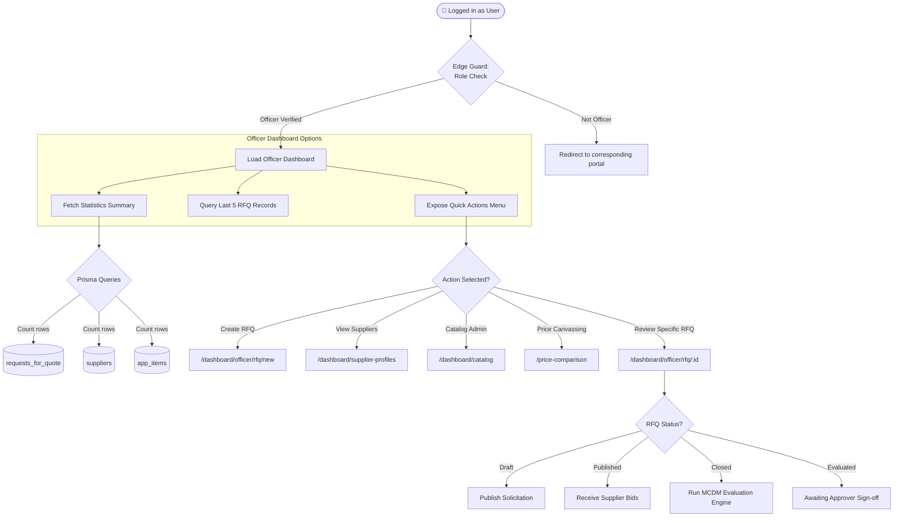

# Procurement Officer Portal Process Flow

This document details the system workflow and process architecture of the **Procurement Officer Portal** at `/dashboard/officer`.

---

## 🔄 Portal Workflow & System Flow Diagram

The diagram below maps the processes, decisions, and system gates available to a Procurement Officer within the portal:

---

## 📈 System Processes & Subsystem Integrations

The system architecture and UI routing are divided into three major processes linked by logical connectors:

### 1. Security & RBAC Gate (Portal Entry)
* **Enforcer**: `requireRole('Procurement Officer')` is executed server-side.
* **Mechanism**: Verifies active cookies, decodes the Supabase JWT session, reads the matched database profile in the `user_profiles` table, and verifies that the `role` enum equals `ProcurementOfficer`. Unverified users are redirected to their corresponding portals.

### 2. Process 1: Dashboard Initialization & Metrics Gathering (Left Diagram)
* **Stats Fetching**: When the Officer Dashboard is loaded, the system queries summary metrics using Prisma queries in parallel via `Promise.all`:
  1. **Count requests_for_quote**: Retrieves the total count of RFQ solicitations.
  2. **Count suppliers**: Retrieves the total count of registered vendors.
  3. **Count app_items**: Retrieves the count of items in the standardized database catalog.
* **Recent RFQs**: Automatically queries and lists the last 5 RFQ records for quick access.
* **Quick Actions Entry**: Loads the quick actions menu which serves as the router to **Connector A**.

### 3. Process 2: Quick Actions Navigation Router — Connector A (Middle Diagram)
Using the Quick Actions menu (**Connector A**), the Procurement Officer can navigate to different operational modules:
* **Create RFQ**: Routes to `/dashboard/officer/rfq/new` to draft new solicitations.
* **View Suppliers**: Routes to `/dashboard/supplier-profiles` (mapped as `/dashboard/officer/profiles` in the diagram) to view vendor reliability and compliance ratings.
* **Price Canvassing**: Routes to `/price-comparison` (mapped as `/pricecomparison` in the diagram) to cross-compare market catalog rates.
* **Catalog Admin**: Routes to `/dashboard/catalog` to update and standardize the product specifications.
* **Review Specific RFQ**: Routes to `/dashboard/officer/rfq/:id` to manage detailed RFQ actions, forwarding execution to **Connector B**.

### 4. Process 3: RFQ Lifecycle State Machine — Connector B (Right Diagram)
Once inside a detailed RFQ view (**Connector B**), actions are determined by the current status of the solicitation:
* **Draft**: The officer reviews specs and clicks "Publish", triggering `publishSolicitation` to move the status to `Published`.
* **Published**: The solicitation is active. The system receives supplier bids (manual uploads or spreadsheet parsing).
* **Closed**: Bidding is shut. The officer runs the **MCDM Evaluation Engine** to normalize quotes, calculate composite scores, rank candidate bids, and save recommendations.
* **Evaluated**: The ranks are completed and locked. The RFQ enters the **Awaiting Approver Sign-off** state where it awaits Administrative Approver review and final authorization.
