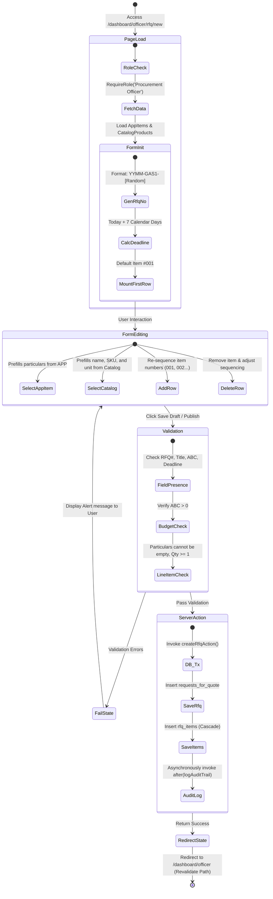

# Request for Quotation (RFQ) Creation Process Flow

This document outlines the detailed system and data workflow behind the RFQ Creation Page located at [new/page.tsx](file:///c:/Users/sy/procurewise/src/app/dashboard/officer/rfq/new/page.tsx) and [RfqCreationForm.tsx](file:///c:/Users/sy/procurewise/src/components/officer/RfqCreationForm.tsx).

---

## 🔄 Lifecycle & State Flow Diagram

The lifecycle of an RFQ starting from page initialization to draft/publishing submission is illustrated below:

---

## 📋 Comprehensive Phase Details

### 1. Verification & Pre-fetching Phase
* **Access Control**: The edge route first executes `requireRole('Procurement Officer')`. If the active session is not mapped to an officer role, they are redirected to their corresponding home dashboard or unauthorized gate page.
* **Pre-loading Lists**: The page pre-loads active **Annual Procurement Plan (APP)** and **Product Catalog** records, mapping attributes like `papCode`, `generalDescription`, `sku`, `unitOfMeasure`, and `estimatedUnitCost` so they are immediately available to pre-fill rows.

### 2. Auto-Generation & Initial Setup Phase
* **Reference Generator**: Initializes `rfqNumber` using a standard format: `[YY][MM]-GAS1-[3-Digit-Random]` (e.g. `2606-GAS1-482`).
* **Initial Deadline**: Automatically computes a default deadline date set to **7 calendar days** from today.
* **Grid Initialization**: Mounts the requisition form with one empty row containing index `001`, unit `pcs`, and quantity `1`.

### 3. User Input & Linking Logic
* **APP Linking**: Selecting an APP project code dynamically copies the general description of the approved requisition to the row particulars field.
* **Catalog Linking**: Selecting a product from the central catalog pulls the pre-approved standard specifications, SKU, and default units (e.g., *ream*, *box*, *lot*), maintaining name uniformity across procurements.
* **Re-sequencing Grid**: Adding or removing rows invokes a layout helper that recalculates sequence indices (e.g. `001`, `002`, `003`...) dynamically.

### 4. Validation Rules & Constraints
Before hitting the DB, client-side safety checks enforce the following criteria:
* **RFQ Reference**: Must be filled and unique.
* **Approved Budget for Contract (ABC)**: Enforces decimal validation and must be greater than zero.
* **Deadline Date**: Must be selected.
* **Item Properties**: Every row must have non-empty description specs, quantity greater than or equal to 1, and a valid unit.

### 5. Server Action & Auditing Transaction
* **Server Action**: When the officer submits, `createRfqAction` executes within a database transaction block (`prisma.$transaction`).
* **Auditing**: On transaction success, the audit logger intercepts the creation snapshot and asynchronously adds an audit trail record mapping the IP address, user UUID, and state changes to the `audit_trails` table.
* **Revalidation**: Runs `revalidatePath('/dashboard/officer')` before forcing a browser redirect to show the newly created draft/published solicitation.
