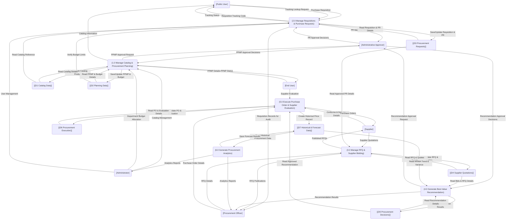

# ProcureWise Data Flow Diagrams (DFD)

> [!NOTE]
> This document details the logical data flows, external entities, business processes, and data stores of the **ProcureWise Procurement Management System** at Batanes State College. These diagrams are designed to be thesis-ready, professional, and strictly representative of the actual implemented system architecture.

---

## 1. Introduction

### Purpose of Data Flow Diagrams
A Data Flow Diagram (DFD) is a graphical representation of the path data takes through an information system. It defines how data is received, processed, stored, and distributed within the ProcureWise system. The primary purpose of these diagrams is to provide a logical, implementation-independent view of the system’s business processes, making it accessible for software engineers, database administrators, and academic thesis panels.

### Difference between Flowcharts and DFDs
While both flowcharts and DFDs are used to model software systems, they serve distinct purposes:
* **Flowcharts** represent the sequential flow of control, execution logic, and decision paths (algorithms). They focus on *how* a process operates step-by-step.
* **Data Flow Diagrams (DFDs)** represent the flow of information through the system. DFDs emphasize *what* data moves through the system, where it originates (external entities), how it is transformed (processes), where it is stored (logical data stores), and where it is output. DFDs do not show sequential execution loops or low-level control structures.

### Mermaid Notation
This document uses standard GFM-compatible Mermaid notation to render diagrams. The DFD elements are modeled as follows:
* **External Entity**: Modeled using bracket notation `[External Entity]` representing sources or sinks of data (e.g., users, roles, or external systems).
* **Process**: Modeled using rounded parentheses `(Process Name)` representing logical data transformation tasks.
* **Logical Data Store**: Modeled using double-parentheses cylinder-like notation `[(Logical Data Store)]` representing persistent repositories of business data.
* **Data Flow**: Modeled using directed arrows with explicit text labels `-->|Data Description|` depicting the moving data packets.

### Scope of ProcureWise DFDs
The scope of these diagrams encompasses the entire Batanes State College procurement lifecycle implemented in ProcureWise, from annual procurement planning (PPMP) and requisition tracking (PR), through bidding canvassing (RFQ), MCDM recommendation evaluation, purchase order processing, supplier evaluations, historical price ingestion, and ARIMA-based forecasting.

---

## 2. DFD Level 0 — Context Diagram

The Context Diagram represents the highest-level logical view of the ProcureWise Procurement Management System. It bounds the system scope by depicting a single central process interacting with external entities.

```mermaid
graph TD
    System("(ProcureWise Procurement Management System)")

    %% External Entities
    PublicUser("[Public User]")
    EndUser("[End User]")
    Officer("[Procurement Officer]")
    Approver("[Administrative Approver]")
    Supplier("[Supplier]")
    Admin("[Administrator]")

    %% Public User Flows
    PublicUser -->|Purchase Requisition| System
    System -->|Requisition Tracking Code| PublicUser
    PublicUser -->|Tracking Lookup Request| System
    System -->|Tracking Status| PublicUser
    System -->|Catalog Information| PublicUser

    %% End User (Department Personnel) Flows
    EndUser -->|PPMP Details| System
    EndUser -->|Supplier Evaluation| System
    System -->|PPMP Status| EndUser
    System -->|Purchase Request Status| EndUser

    %% Procurement Officer Flows
    Officer -->|RFQ Details| System
    Officer -->|Purchase Order Details| System
    System -->|Requisition Records| Officer
    System -->|RFQ Publications| Officer
    System -->|Recommendation Results| Officer

    %% Administrative Approver Flows
    Approver -->|Approval Decisions| System
    System -->|PPMP Approval Requests| Approver
    System -->|Purchase Request Approval Requests| Approver
    System -->|Recommendation Approval Requests| Approver

    %% Supplier Flows
    Supplier -->|Supplier Quotations| System
    System -->|Published RFQs| Supplier
    System -->|Purchase Orders| Supplier

    %% Administrator Flows
    Admin -->|Department Budget Allocation| System
    Admin -->|Catalog Management| System
    Admin -->|User Management| System
    System -->|Updated Catalog| Admin
    System -->|Department Budgets| Admin
    System -->|Analytics Reports| Admin
```

### External Entity Flows

* **Public User**:
  * **Inputs**: Initiates the procurement workflow by submitting a `Purchase Requisition` (PR) and queries the system with a `Tracking Lookup Request`.
  * **Outputs**: Receives a generated `Requisition Tracking Code` upon submission, reviews the requested `Tracking Status`, and browses read-only `Catalog Information`.
* **End User (Department Personnel)**:
  * **Inputs**: Prepares annual plans by submitting `PPMP Details` and evaluates supplier performance by submitting a `Supplier Evaluation`.
  * **Outputs**: Monitors workflow states via the `PPMP Status` and `Purchase Request Status` trackers.
* **Procurement Officer**:
  * **Inputs**: Coordinates solicitations by submitting `RFQ Details` and drafts contracts using `Purchase Order Details`.
  * **Outputs**: Reviews pending `Requisition Records` for audit, reviews `RFQ Publications`, and receives MCDM `Recommendation Results`.
* **Administrative Approver**:
  * **Inputs**: Confirms or rejects proposals by submitting `Approval Decisions`.
  * **Outputs**: Audit queues for `PPMP Approval Requests`, `Purchase Request Approval Requests`, and `Recommendation Approval Requests`.
* **Supplier**:
  * **Inputs**: Submits bids via `Supplier Quotations`.
  * **Outputs**: Audits incoming `Published RFQs` and signs off on `Purchase Orders`.
* **Administrator**:
  * **Inputs**: Feeds setup variables via `Department Budget Allocation`, `Catalog Management`, and `User Management`.
  * **Outputs**: Audits settings via `Updated Catalog` confirmations, `Department Budgets` checks, and `Analytics Reports`.

---

## 3. DFD Level 1 — Detailed Data Flow Diagram

The Level 1 Data Flow Diagram decomposes the ProcureWise system into its six core logical business processes and seven consolidated logical data stores.

---

## 4. Logical Business Processes

### Process 1.0: Manage Catalog & Procurement Planning
* **Responsibilities**: Enables administrators to curate the central product catalog, allows department personnel to search catalog specifications, construct annual procurement drafts (PPMPs), track plan approval status, and manage allocated fiscal budgets.
* **Inputs & Outputs**:
  * Receives `PPMP Details` from `End User`.
  * Receives `Catalog Management` and `Department Budget Allocation` inputs from `Admin`.
  * Exchanges approval requests and decisions with `Approver`.
  * Outputs `PPMP Status` to `End User` and `Catalog Information` to `Public User`.
* **Data Store Reads/Writes**:
  * Writes to and reads from `[(D1 Catalog Data)]` to store catalog entries.
  * Writes to and reads from `[(D2 Planning Data)]` to persist planning structures.

### Process 2.0: Manage Requisitions & Purchase Requests
* **Responsibilities**: Facilitates the submission of unauthenticated department requisitions by public users, conducts validation against departmental budgets, enables officer audits/inline specifications adjustments, converts approved requisitions to purchase requests, and generates tracking tokens.
* **Inputs & Outputs**:
  * Receives `Purchase Requisition` and `Tracking Lookup Request` from `Public User`.
  * Receives `User Management` setup details from `Admin`.
  * Exchanges approval requests and decisions with `Approver`.
  * Sends `Requisition Records for Audit` to `Officer`.
  * Outputs `Requisition Tracking Code` and `Tracking Status` to `Public User`.
* **Data Store Reads/Writes**:
  * Reads `[(D1 Catalog Data)]` for standard spec conversions.
  * Reads `[(D2 Planning Data)]` to verify departmental budget limitations.
  * Writes to and reads from `[(D3 Procurement Requests)]` to persist requisition records.

### Process 3.0: Manage RFQ & Supplier Bidding
* **Responsibilities**: Initiates bidding rounds by converting approved purchase requests into formal Requests for Quotations (RFQs). Handles publishing bidding details and captures manual or spreadsheet-based supplier bid responses.
* **Inputs & Outputs**:
  * Receives `RFQ Details` from `Officer`.
  * Receives `Supplier Quotations` from `Supplier`.
  * Outputs `Published RFQs` to `Supplier` and `RFQ Publications` to `Officer`.
* **Data Store Reads/Writes**:
  * Reads `[(D3 Procurement Requests)]` to extract approved PR details.
  * Writes to and reads from `[(D4 Supplier Quotations)]` to manage solicitation bidding databases.

### Process 4.0: Generate Best-Value Recommendation
* **Responsibilities**: Aggregates submitted bids, pulls historical statistics and ARIMA price forecasting metrics, and executes the Multi-Criteria Decision-Making (MCDM) scoring engine. Generates ranked recommendations alongside compliant justification logs.
* **Inputs & Outputs**:
  * Exchanges approval requests and decisions with `Approver`.
  * Sends finalized MCDM `Recommendation Results` to `Officer`.
* **Data Store Reads/Writes**:
  * Reads `[(D4 Supplier Quotations)]` to query active bid arrays.
  * Reads `[(D7 Historical & Forecast Data)]` to load forecast trends and price coefficients.
  * Writes to and reads from `[(D5 Procurement Decisions)]` to record the decision logs.

### Process 5.0: Execute Purchase Order & Supplier Evaluation
* **Responsibilities**: Processes approved canvasses into standard government Purchase Orders (POs) featuring conforme confirmation locks, captures delivery receipts, and aggregates 7-criteria supplier performance evaluations. Writes finalized transaction records to create historical benchmarks.
* **Inputs & Outputs**:
  * Receives `Purchase Order Details` from `Officer`.
  * Receives `Supplier Evaluation` ratings from `End User`.
  * Receives `Conforme & Delivery Details` from `Supplier`.
  * Outputs signed `Purchase Orders` to `Supplier`.
* **Data Store Reads/Writes**:
  * Reads `[(D5 Procurement Decisions)]` to verify approved award parameters.
  * Writes to and reads from `[(D6 Procurement Execution)]` to manage POs and evaluations.
  * Writes to `[(D7 Historical & Forecast Data)]` via the action `Create Historical Price Record` upon PO completion and delivery.

### Process 6.0: Generate Procurement Analytics
* **Responsibilities**: Conducts background time-series analytics on completed procurement transactions. Fits ARIMA models on past trends, computes MAPE error scores, checks stationarity, generates future price projections, and updates the decision intelligence dashboard.
* **Inputs & Outputs**:
  * Outputs dynamic `Analytics Reports` to `Admin` and `Officer`.
* **Data Store Reads/Writes**:
  * Reads from `[(D7 Historical & Forecast Data)]` via `Read Historical Procurement Data` to extract historical price records.
  * Writes back to `[(D7 Historical & Forecast Data)]` via `Save Forecast Results` to store the generated ARIMA forecast metrics.

---

## 5. Logical Data Store Mapping

Logical data stores group physical database tables based on their shared business domain:

| Logical Data Store | Purpose & Scope | Mapped Prisma Models |
| :--- | :--- | :--- |
| **D1: Catalog Data** | Standard office, hardware, and school supplies catalog. | `CatalogProduct`, `Category`, `Brand`, `UnitOfMeasure` |
| **D2: Planning Data** | Annual procurement plans and budget records. | `Ppmp`, `PpmpItem`, `DepartmentBudget` |
| **D3: Procurement Requests** | Requisitions, line items, and audit requests. | `Requisition`, `RequisitionItem`, `PurchaseRequest`, `PurchaseRequestItem` |
| **D4: Supplier Quotations** | Solicitations and vendor bid quotations. | `RequestForQuote`, `RfqItem`, `SupplierQuote`, `QuoteDetail` |
| **D5: Procurement Decisions** | MCDM score results and compiled canvass abstracts. | `Recommendation`, `CanvasAbstract` |
| **D6: Procurement Execution** | Finalized contracts, conforme slips, and evaluations. | `PurchaseOrder`, `PurchaseOrderItem`, `SupplierEvaluation` |
| **D7: Historical & Forecast Data** | Time-series observations and ARIMA models. | `HistoricalPrice`, `Forecast` |
