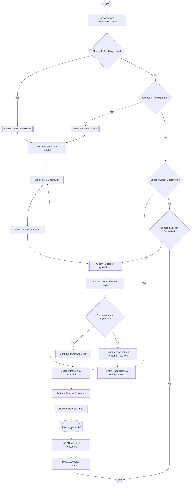
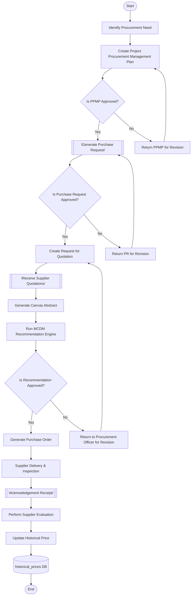
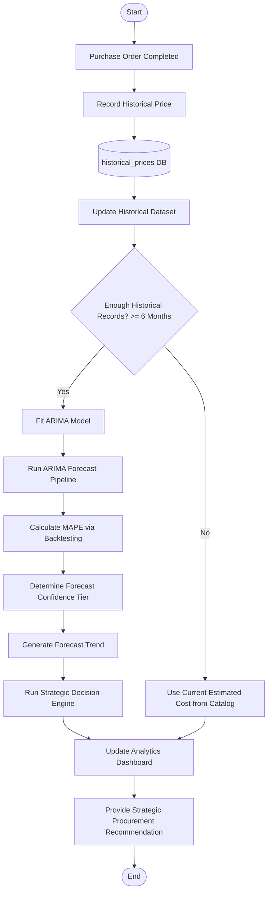
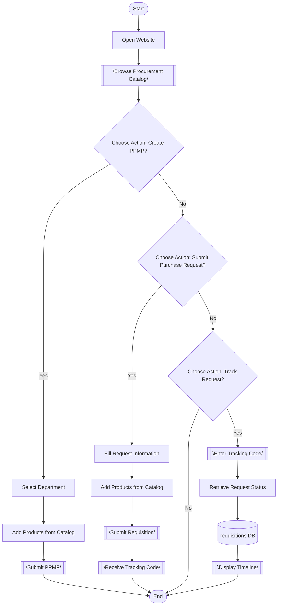
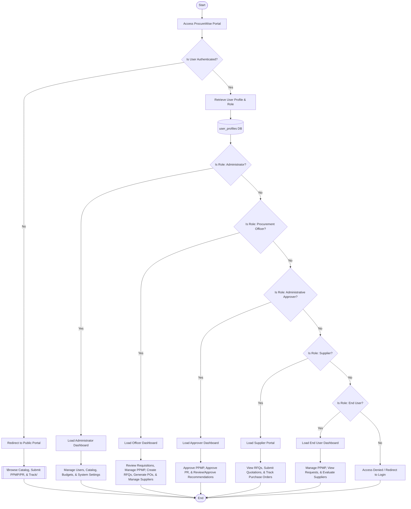

# ProcureWise System Flowcharts

This document consolidates the system workflows and process architectures of the **ProcureWise Procurement Management System** at Batanes State College. These flowcharts are designed to be thesis-ready, professional, fully connected, and directly representative of the actual system implementation.

---

## 📋 Diagram Verification Standards

Every flowchart in this documentation adheres to the following strict modeling criteria:
* **Start / End**: Represented by a Terminator `([Start])` / `([End])`. Exactly one Start and one End node are present per diagram.
* **Process**: Represented by a Rectangle `[Process]`.
* **Decision**: Represented by a Diamond `{"Decision?"}`. All decisions contain explicit `Yes` and `No` branches (or equivalent logical binaries).
* **Input / Output**: Represented by a Parallelogram `[\Input / Output/]` for data exchange or document generation.
* **Database**: Represented by a Cylinder `[(Database)]` when reading or writing persistent database records.
* **Structure**: Clean, top-to-bottom layout with zero orphan/floating nodes and no crossing connectors.

---

## 1. Overall ProcureWise System Workflow
This master workflow maps the entire procurement lifecycle from initial user entry down to forecasting updates and analytics.

---

## 2. Procurement Workflow
This diagram illustrates the unified, continuous procurement pipeline: planning (PPMP), purchase requesting (PR), solicitation (RFQ), bidding, objective scoring (MCDM), purchasing (PO), delivery, evaluation, and pricing audits.

---

## 3. Intelligent Procurement Analytics Workflow
This diagram isolates the forecasting and analytical components, illustrating how historical price feeds are parsed, validated using MAPE backtesting, and evaluated for purchasing optimization.

---

## 4. Public User Workflow
This workflow displays the application paths accessible to public, unauthenticated end-users on the platform.

---

## 5. User Access Workflow
This flowchart maps the user roles authenticated by the security gateway, outlining the actions and dashboards each role can access.

