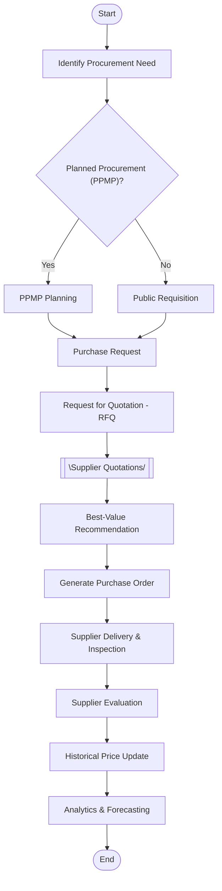
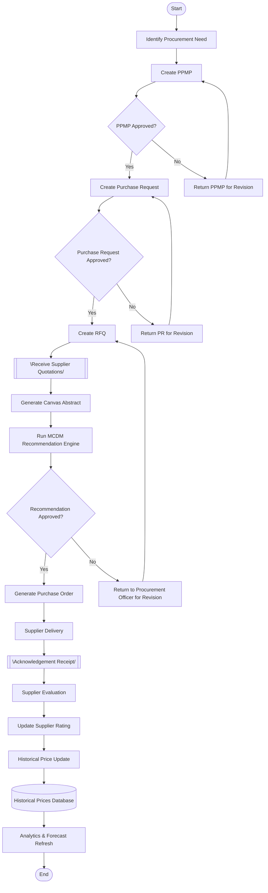
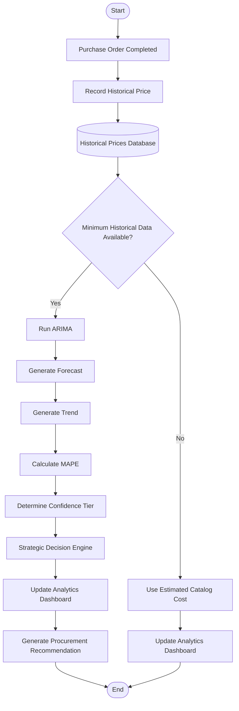
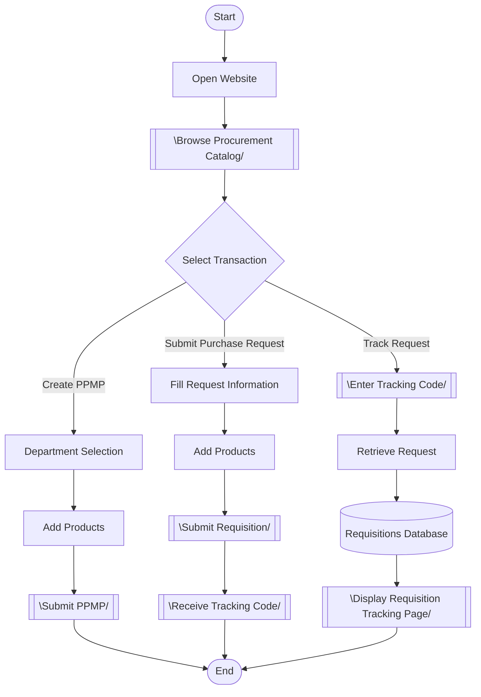
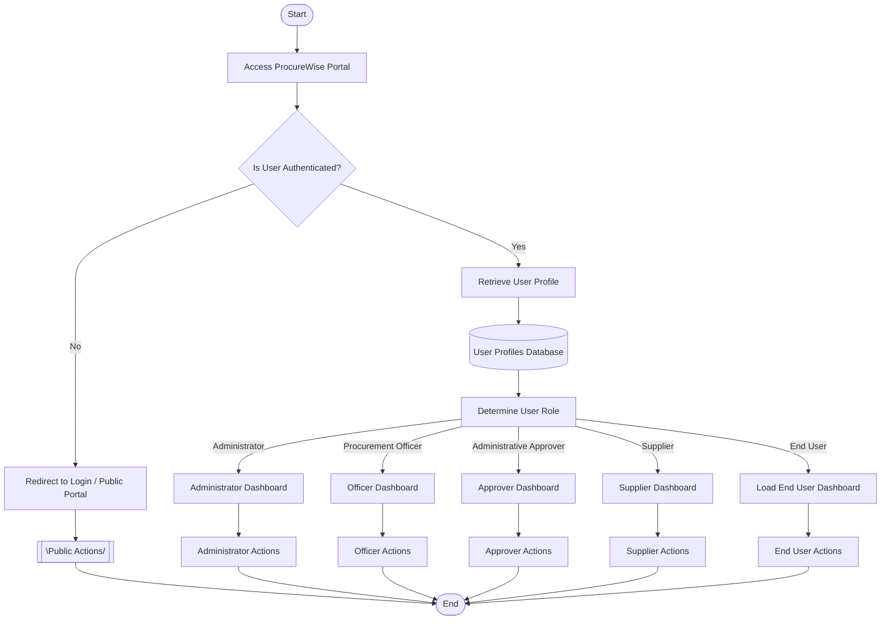

# ProcureWise System Flowcharts

> [!NOTE]
> This document presents the logical workflows of the ProcureWise Procurement Management System. Certain implementation details such as middleware execution, validation routines, API layers, and database transactions have been abstracted for clarity while preserving the actual business workflow.

This document consolidates the system workflows and process architectures of the **ProcureWise Procurement Management System** at Batanes State College. These flowcharts are designed to be thesis-ready, professional, fully connected, and directly representative of the actual system implementation.

---

## 📋 Diagram Verification Standards

Every flowchart in this documentation adheres to the following strict modeling criteria:
* **Start / End**: Represented by a Terminator `([Start])` / `([End])`. Exactly one Start and one End node are present per diagram.
* **Process**: Represented by a Rectangle `[Process]`.
* **Decision**: Represented by a Diamond `{"Decision?"}`. All decisions contain explicit `Yes` and `No` (or equivalent logical selection) branches.
* **Input / Output**: Represented by a Parallelogram `[\Input / Output/]` for data exchange or document generation.
* **Database**: Represented by a Cylinder `[(Database)]` when reading or writing persistent database records.
* **Structure**: Clean, top-to-bottom layout with zero orphan/floating nodes and no crossing connectors.

---

## 1. Overall ProcureWise System Workflow
This master workflow maps the high-level stages of the complete procurement lifecycle, branching into planned or public requisition paths before compiling purchase requests, solicitude RFQs, recommendations, delivery, and time-series forecasting.

---

## 2. Procurement Workflow
This diagram illustrates the detailed operational procurement pipeline, incorporating the planning, approval, canvassing, scoring, and performance evaluation stages.

---

## 3. Intelligent Procurement Analytics Workflow
This diagram illustrates the time-series pricing analysis and decision support system workflow, verifying the minimum historical dataset before executing the ARIMA forecasting model.

---

## 4. Public User Workflow
This flowchart outlines the transaction routes available to public, unauthenticated platform visitors: catalog browsing, drafting plans, requisitions, and checking tracking status.

---

## 5. User Access Workflow
This flowchart details user dashboard routing based on role credentials resolved by the secure database profile gate.

