# ProcureWise UML Use Case Diagram & Actor Specifications

> [!NOTE]
> This document details the UML Use Case Diagram, actor specifications, and use case definitions for the **ProcureWise Procurement Management System** at Batanes State College. It maps the system boundaries and interactions based directly on the actual implemented state of the codebase.

---

## 1. System Actors & Use Cases

This section lists the system actors defined in ProcureWise and details the specific use cases each actor performs.

### 👤 Public User
* **Description**: An unauthenticated user (e.g., general public or college personnel accessing tracking tools without logging in).
* **Use Cases**:
  * **UC-01: Browse Catalog & Compare Prices**: Allows users to search, filter, and inspect supply items, categories, brands, and units of measure.
  * **UC-02: Submit Purchase Requisition**: Enables users to submit initial purchase requisitions (PRs) outlining needed quantities, specifications, and estimated costs.
  * **UC-03: Track Requisition Status**: Allows users to input a cryptographically secure tracking UUID to monitor the approval progress of their submitted requisitions.

### 👤 End User (Department Personnel)
* **Description**: A registered department representative who plans annual supply requisitions and rates supplier performance.
* **Use Cases**:
  * **UC-04: Prepare PPMP Draft**: Drafts the Project Procurement Management Plan (PPMP) for the department, specifying quantities linked to standard catalog items.
  * **UC-05: Monitor Requisition/PR Status**: Views and monitors the progress of department PPMPs and Purchase Requests from their dedicated dashboard.
  * **UC-06: Submit Supplier Evaluation**: Rates supplier performance post-delivery on a 7-criteria scorecard (Quality, Delivery, Price, etc.) to update supplier metrics.

### 💼 Procurement Officer (Staff)
* **Description**: The primary staff user coordinating procurement solicitations, canvassing, MCDM rankings, and Purchase Orders.
* **Use Cases**:
  * **UC-07: Manage Product Catalog**: Curates, adds, updates, and deletes supply products, categories, brands, and units of measure in the central database.
  * **UC-08: Review & Process Purchase Requests**: Inspects incoming department requisitions, adjusts inline specifications or UOMs, edits budget spent allocations, checks budget limits, and forwards approved requests to the bidding pipeline.
  * **UC-09: Prepare & Publish RFQs**: Sets deadlines and publishes Requests for Quotation (RFQs) featuring sequential reference numbering.
  * **UC-10: Encode/Parse Supplier Quotations**: Manually encodes quotes or uploads and parses Excel quote spreadsheets submitted offline by suppliers.
  * **UC-11: Generate Canvas Abstract**: Consolidates active bids, pricing tiers, and delivery parameters into a canvas board.
  * **UC-12: Execute MCDM Recommendation**: Triggers the Multi-Criteria Decision-Making (MCDM) scoring engine and edits sensitivity sliders to generate ranked recommendations and compliance justifications.
  * **UC-13: Generate & Print Purchase Orders**: Drafts standard government Purchase Orders (Appendix 61) with custom clauses and records conforme statuses.
  * **UC-14: Monitor Procurement Analytics**: Analyzes real-time metrics, budget utilization status, radar profile spider charts, cost savings, and ARIMA forecast alerts.

### ⚖️ Administrative Approver (Staff)
* **Description**: The college administrator responsible for final oversight and sign-off on budgets, requests, and canvass awards.
* **Use Cases**:
  * **UC-15: Approve PPMPs**: Reviews, approves, or returns department-level PPMPs for revision.
  * **UC-16: Approve Purchase Requests**: Authorizes purchase requisitions, moving them forward to RFQ status.
  * **UC-17: Approve Best-Value Recommendations**: Signs off on MCDM-generated abstracts, officially awarding procurement contracts.
  * **UC-18: Review Procurement Reports**: Views executive analytics and downloads CSV data exports (PPMPs, PRs, RFQs, POs, and Suppliers).

### ⚙️ Administrator (IT Admin)
* **Description**: The system support administrator managing user accounts and system configuration.
* **Use Cases**:
  * **UC-19: Manage User Accounts**: Registers staff, activates or deactivates user accounts, and monitors user roles.
  * **UC-20: Maintain Catalog Settings**: Maintains system parameters, categories, brands, and catalog items.
  * **UC-21: Configure System Parameters**: Configures system configurations, environment options, and threshold constants.
  * **UC-22: Monitor System Action Logs**: Audits forensic database logs containing session IDs, IP addresses, and timestamps for compliance tracking.

### 🏢 Supplier (External / Secondary Actor)
* **Description**: A registered external business vendor who provides bids and delivers supplies. Suppliers do not log in directly.
* **Use Cases**:
  * **UC-09: Prepare & Publish RFQs** *(Secondary)*: Receives invitations and checks open published RFQs.
  * **UC-10: Encode/Parse Supplier Quotations** *(Secondary)*: Submits quotation bids (via manual papers or Excel templates) to be input into the system.
  * **UC-13: Generate & Print Purchase Orders** *(Secondary)*: Acknowledges approved Purchase Orders (signs conforming slips) and delivers supplies.

---

## 2. Traceability Matrix

The following matrix maps the defined ProcureWise system Use Cases to their corresponding user roles, system modules, flowcharts, and Data Flow Diagram (DFD) processes.

| Use Case ID | Use Case Name | Primary Actor(s) | Secondary Actor(s) | System Module | Mapped System Flowchart (`docs/system_flowcharts.md`) | Mapped DFD Process (`docs/data_flow_diagrams.md`) |
| :--- | :--- | :--- | :--- | :--- | :--- | :--- |
| **UC-01** | Browse Catalog & Compare Prices | Public User | — | Catalog Module | Section 4: Public User Workflow | Process 1.0: Manage Catalog & Planning |
| **UC-02** | Submit Purchase Requisition | Public User | — | Requisitions Module | Section 4: Public User Workflow | Process 2.0: Manage Requisitions & PR |
| **UC-03** | Track Requisition Status | Public User | — | Requisitions Module | Section 4: Public User Workflow | Process 2.0: Manage Requisitions & PR |
| **UC-04** | Prepare PPMP Draft | End User | — | Planning Module | Section 4: Public User Workflow | Process 1.0: Manage Catalog & Planning |
| **UC-05** | Monitor Requisition/PR Status | End User | — | Requisitions Module | Section 5: User Access Workflow | Process 2.0: Manage Requisitions & PR |
| **UC-06** | Submit Supplier Evaluation | End User | — | Evaluation Module | Section 2: Procurement Workflow | Process 5.0: Execute PO & Evaluation |
| **UC-07** | Manage Product Catalog | Procurement Officer | — | Catalog Module | Section 5: User Access Workflow | Process 1.0: Manage Catalog & Planning |
| **UC-08** | Review & Process Purchase Requests | Procurement Officer | — | Requisitions Module | Section 2: Procurement Workflow | Process 2.0: Manage Requisitions & PR |
| **UC-09** | Prepare & Publish RFQs | Procurement Officer | Supplier | RFQ Module | Section 2: Procurement Workflow | Process 3.0: Manage RFQ & Bidding |
| **UC-10** | Encode/Parse Supplier Quotations | Procurement Officer | Supplier | Bidding Module | Section 2: Procurement Workflow | Process 3.0: Manage RFQ & Bidding |
| **UC-11** | Generate Canvas Abstract | Procurement Officer | — | Canvassing Module | Section 2: Procurement Workflow | Process 4.0: Generate Recommendation |
| **UC-12** | Execute MCDM Recommendation | Procurement Officer | — | Decision Engine | Section 2: Procurement Workflow | Process 4.0: Generate Recommendation |
| **UC-13** | Generate & Print Purchase Orders | Procurement Officer | Supplier | Purchase Order | Section 2: Procurement Workflow | Process 5.0: Execute PO & Evaluation |
| **UC-14** | Monitor Procurement Analytics | Procurement Officer | — | Analytics Module | Section 3: Intelligent Analytics | Process 6.0: Generate Analytics |
| **UC-15** | Approve PPMPs | Administrative Approver | — | Planning Module | Section 2: Procurement Workflow | Process 1.0: Manage Catalog & Planning |
| **UC-16** | Approve Purchase Requests | Administrative Approver | — | Requisitions Module | Section 2: Procurement Workflow | Process 2.0: Manage Requisitions & PR |
| **UC-17** | Approve Best-Value Recommendations| Administrative Approver | — | Decision Engine | Section 2: Procurement Workflow | Process 4.0: Generate Recommendation |
| **UC-18** | Review Procurement Reports | Administrative Approver | — | Reports Module | Section 5: User Access Workflow | Process 6.0: Generate Analytics |
| **UC-19** | Manage User Accounts | Administrator | — | Admin Module | Section 5: User Access Workflow | Process 2.0: Manage Requisitions & PR |
| **UC-20** | Maintain Catalog Settings | Administrator | — | Catalog Module | Section 5: User Access Workflow | Process 1.0: Manage Catalog & Planning |
| **UC-21** | Configure System Parameters | Administrator | — | Admin Module | Section 5: User Access Workflow | Process 1.0: Manage Catalog & Planning |
| **UC-22** | Monitor System Action Logs | Administrator | — | Admin Module | Section 5: User Access Workflow | Process 2.0: Manage Requisitions & PR |

---

## 3. UML Use Case Diagram (System Reference Model)

This Mermaid diagram models the system boundary, actors, and use case relationships for documentation reference within the repository.

```mermaid
graph LR
    %% Style Definitions
    classDef actor fill:#eef2f6,stroke:#475569,stroke-width:1px,font-weight:bold;
    classDef usecase fill:#f8fafc,stroke:#64748b,stroke-width:1.5px,rx:20px,ry:20px;
    classDef external fill:#f1f5f9,stroke:#94a3b8,stroke-dasharray: 5 5,stroke-width:1px;

    %% Primary Actors
    PublicUser["👤 Public User"]:::actor
    EndUser["👤 End User<br>(Dept. Personnel)"]:::actor
    Officer["💼 Procurement Officer"]:::actor
    Approver["⚖️ Admin Approver"]:::actor
    Admin["⚙️ Administrator (IT)"]:::actor

    subgraph ProcureWise ["ProcureWise System Boundary"]
        %% Public User Use Cases
        UC1("(UC-01 Browse Catalog & Compare Prices)"):::usecase
        UC2("(UC-02 Submit Purchase Requisition)"):::usecase
        UC3("(UC-03 Track Requisition Status)"):::usecase

        %% End User Use Cases
        UC4("(UC-04 Prepare PPMP Draft)"):::usecase
        UC5("(UC-05 Monitor Requisition/PR Status)"):::usecase
        UC6("(UC-06 Submit Supplier Evaluation)"):::usecase

        %% Procurement Officer Use Cases
        UC7("(UC-07 Manage Product Catalog)"):::usecase
        UC8("(UC-08 Review & Process Purchase Requests)"):::usecase
        UC9("(UC-09 Prepare & Publish RFQs)"):::usecase
        UC10("(UC-10 Encode/Parse Supplier Quotes)"):::usecase
        UC11("(UC-11 Generate Canvas Abstract)"):::usecase
        UC12("(UC-12 Execute MCDM Recommendation)"):::usecase
        UC13("(UC-13 Generate & Print Purchase Orders)"):::usecase
        UC14("(UC-14 Monitor Procurement Analytics)"):::usecase

        %% Administrative Approver Use Cases
        UC15("(UC-15 Approve PPMPs)"):::usecase
        UC16("(UC-16 Approve Purchase Requests)"):::usecase
        UC17("(UC-17 Approve Best-Value Recommendations)"):::usecase
        UC18("(UC-18 Review Procurement Reports)"):::usecase

        %% Administrator Use Cases
        UC19("(UC-19 Manage User Accounts)"):::usecase
        UC20("(UC-20 Maintain Catalog Settings)"):::usecase
        UC21("(UC-21 Configure System Parameters)"):::usecase
        UC22("(UC-22 Monitor System Action Logs)"):::usecase
    end

    %% External / Secondary Actors
    Supplier["🏢 Supplier<br>(External/Secondary)"]:::external

    %% Public User Associations
    PublicUser --> UC1
    PublicUser --> UC2
    PublicUser --> UC3

    %% End User Associations
    EndUser --> UC4
    EndUser --> UC5
    EndUser --> UC6

    %% Procurement Officer Associations
    Officer --> UC7
    Officer --> UC8
    Officer --> UC9
    Officer --> UC10
    Officer --> UC11
    Officer --> UC12
    Officer --> UC13
    Officer --> UC14

    %% Administrative Approver Associations
    Approver --> UC15
    Approver --> UC16
    Approver --> UC17
    Approver --> UC18
    Approver --> UC14

    %% Administrator Associations
    Admin --> UC19
    Admin --> UC20
    Admin --> UC21
    Admin --> UC22

    %% Supplier External Connections
    UC9 -.-> Supplier
    UC10 -.-> Supplier
    UC13 -.-> Supplier
```

---

## 4. Academic Thesis Guidelines

> [!TIP]
> **Thesis Manuscript Recommendation**: While the Mermaid representation above serves as an integrated system reference model inside the markdown documentation, UML diagrams included in academic thesis manuscripts must adhere strictly to formal UML notations (using standard UML stick figures for actors, oval shapes for use cases, solid lines for association relationships, and dotted arrows for dependency/extension relationships).
>
> For your final thesis submission, it is highly recommended to export this logical model into a professional UML modeling tool:
> 1. **Draw.io (diagrams.net)**: Free, web-based tool supporting standard UML shape libraries. Use standard stick figure icons for the five primary actors and secondary external actor.
> 2. **StarUML**: Desktop-based professional UML visual modeler. Ideal for creating clean, standardized UML Use Case Diagrams matching IEEE/ISO guidelines.
> 3. **Visual Paradigm**: Features full system engineering modeling capabilities and generates publication-grade diagrams.
