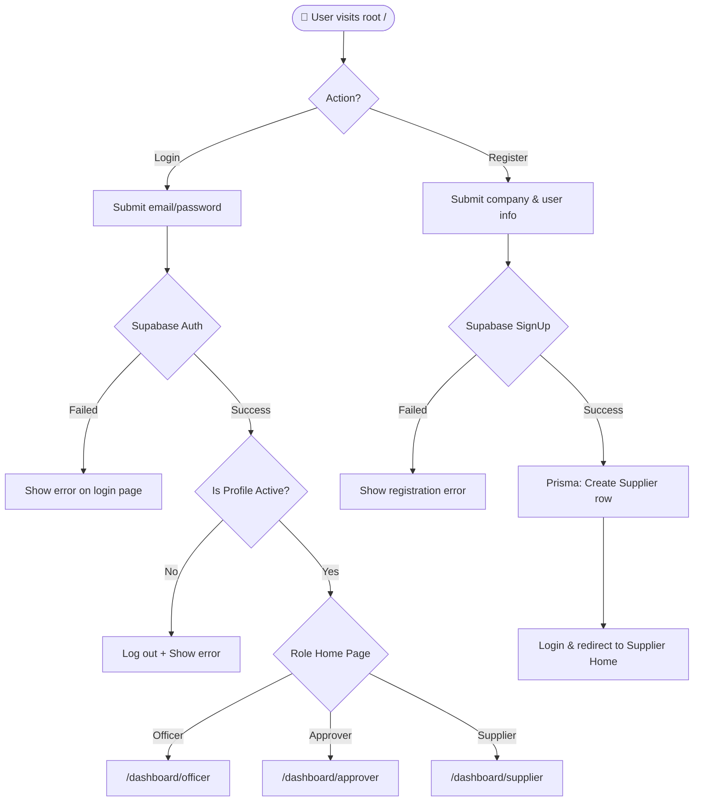

# Login & Registration Portal Process Flow

This document details the system workflow and process architecture of the **Login & Registration Portal** at `/` (root page).

---

## 🔄 Simplified Workflow Diagram

---

## 📋 Core Processes

### 1. Unified Authentication
* **Supabase Validation**: Authenticates credentials using Supabase Auth.
* **Profile Gate**: Checks `user_profiles` to verify the account is `isActive`. If deactivated, logs the user out.
* **Role Routing**: Directs users to their specific dashboard based on their database role.

### 2. Supplier Registration
* **Account Creation**: Registers credentials on Supabase Auth, triggering an automatic sync into the `user_profiles` database table.
* **Vendor Database**: Saves business details (TIN, contact numbers, and business address) into the `suppliers` database table.

